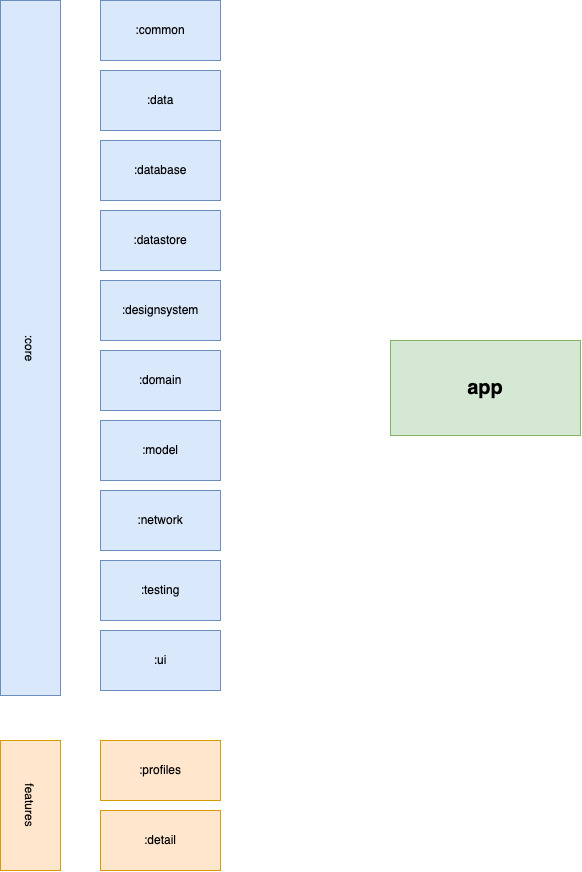
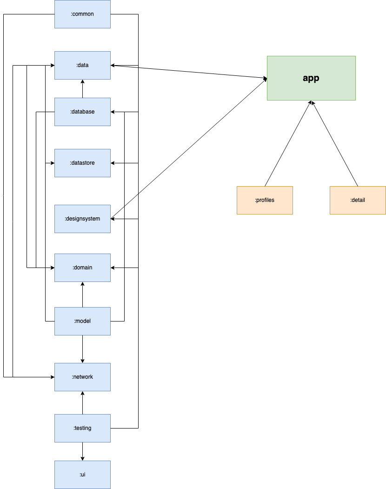
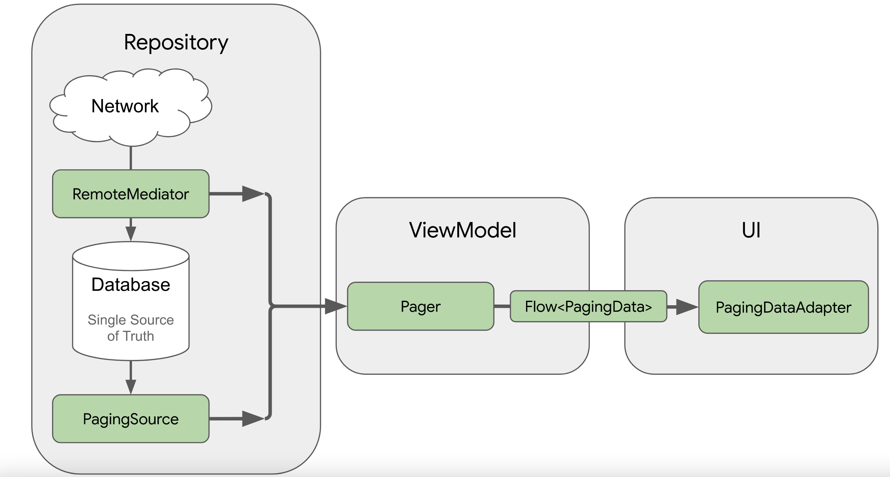

# Qonto Challenge
## Creating an offline app

[

## Challenge

Build an application that fetches data from this API - [https://randomuser.me](https://randomuser.me/) - and displays a list of Users.
Start by reading the API documentation [https://randomuser.me/documentation](https://randomuser.me/documentation).
Your application should display a list of Users. Each item in the list should contain first and last names on one line and the email below.
As the user scrolls down the list the application should fetch incremental number of pages.
Finally, while offline, previously loaded Users should still be accessible from the list. We recommend you implement this based on a classic database solution like Room.

## References

For the creation of this project I have based myself on a mixed solution of modularization by layers and features, as recommended by Android in its latest articles(https://www.youtube.com/watch?v=16SwTvzDO0A).

The project follows as a reference the app that Android uses in an educational way about Architectures, and especially about the modularization of the app, in order to respect as far as possible the Clean Architecture and the Separation of Concerns.

https://developer.android.com/topic/modularization

The following image shows the basic structure of the app:

## Used technology

- MVI Pattern
- ROOM as database
- Coil for images
- Hilt as Dependency Injector
- Paging3 as pagination & caching enginee
- Compose for the views
- Flow
- Kotlin DSL

## Technical decisions

##### Modularization by layers and features:

As I have commented before, I have made a modularization of the project by layers and features, thus following the android recommendations on architecture, focusing on the separation of concerns and making the app expandable and easily maintainable by the development team (where it is perfectly can be worked in different modules without conflicts when working).

The dependencies between modules can be seen in the following scheme:

##### Paging3 as paging and caching engine:

One of the most important decisions I have made in this project has been to use the Jectpack Paging library, to manage paging and caching.
It has been complicated since I had never worked with it and the truth is that it has taken me a long time to implement it, even not perfectly, since there are some problems with the list scroll that I have not been able to solve due to lack of time, since I need to debug to know exactly what's going on and I haven't had time.

Despite being a very complete solution, since it is in charge of all the management of cached information and paging, it is true that it breaks the data flow that I had in mind for this app, and that I have exposed in the detail screen. I know that the detail screen was not in this statement, but I wanted to create it to apply the data flow that I usually like, with MVI. Meanwhile, with Paging the flow varies slightly, as can be seen in the following image:

Using Paging I have been able to understand how this library works, which has been pleasant, since Android is quite committed to it and its implementation has always been somewhat complex for developers, by using their own objects throughout almost the entire data flow. Also, with Paging we don't need the typical Events/State to communicate the ViewModel with the view, since the PagingData manages all that, already having in the Composable the different states of the data through Paging.

The usual flow of data with which I usually work is what you can see in the following image (although with Paging it has been completely broken).

##### Testing: the missing part of the test:

Due to my lack of time due to the problems with Paging and the effort to generate a clean and scalable architecture, I have not been able to develop tests for this project, when I was planning to add Screenshots for the Composables and some unit tests in the different modules.

I promise to return to this topic outside of this challenge for Qonto, in order to have an app with all these implementations ready.

##### Design System:

Given the importance of design systems in an app with Compose, I have generated a module that contains all the information corresponding to it, with colors, buttons, backgrounds, etc... customized for this app.

##### Datastore:

I had generated the datastore module with the idea of putting a button to change the Theme (dark/light) on hot and store its variable there, but again I couldn't finish it due to lack of time. It only remains to put the button and call the method to save that boolean on the dark theme.

## Improvements to be made in this project

Among the improvements that can be made to this (unfinished) project are:

- Carrying out tests, both unitary and Screenshots, with the compose libraries with junit, as well as the use of Paparazzi or other similar Snapshots libraries.
- Optimization of the list with the Paging RemoteMediator, where scroll errors have been detected and may be due to the data source or the configuration and management of the LazyList for Paging3.
- Improvement of the views in Compose, since due to lack of time and little practice with Compose, I have not been able to do a UI job that I feel proud of.

## Reflections

I have tried to carry out the project with the greatest ambition (which has not been good) and humility, hoping to improve the knowledge I have acquired. Thanks to Qonto for this opportunity.
